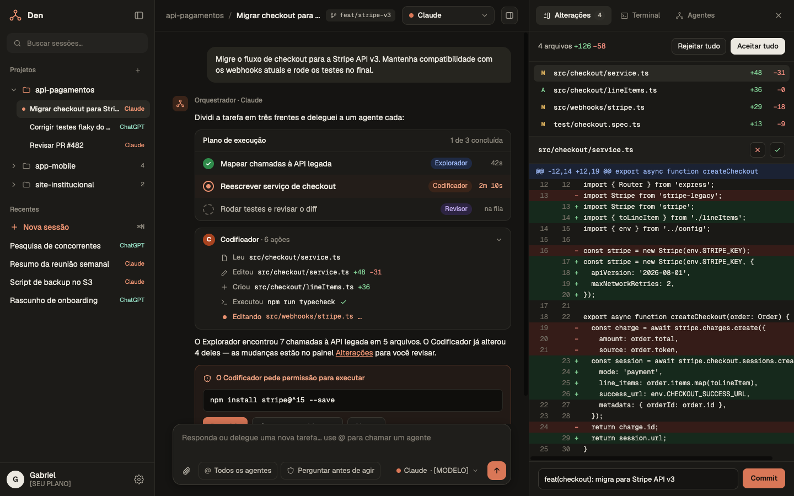

# Migração do Den de Swift para React + Tauri

Data: 2026-09-29  
Status: levantamento e plano de execução  
Plataforma inicial: macOS  
Estratégia: reescrita incremental lado a lado, entregue em PRs empilhados

## Resumo executivo

O Den não é apenas uma interface SwiftUI. A interface representa cerca de 8,5 mil linhas,
mas o repositório também contém um backend Swift relevante: persistência de sessões, execução
e controle de processos, protocolos NDJSON e JSON-RPC/ACP, integrações com Claude Code e
OpenCode, leitura de Git, PTY para configurações de execução e migração de dados legados.

A divisão recomendada é:

- React + TypeScript: apresentação, interação, estado efêmero da interface e acessibilidade.
- Rust/Tauri: processos, filesystem, Git, PTY, persistência, descoberta dos CLIs, protocolos
  dos harnesses e estado canônico das sessões vivas.
- IPC tipado: comandos para operações pontuais e `Channel` para streams de conversa e logs.

Não é recomendável portar tela por tela deixando regra de negócio no frontend, nem expor shell
e filesystem genéricos ao WebView. Os caminhos de projeto e os comandos executados pelo Den são
dinâmicos; essa autoridade deve ficar em comandos Rust próprios e estreitos.

O app Swift deve permanecer compilável e testável até a PR de corte. Ele funciona como oráculo
de comportamento e como caminho de rollback enquanto o novo app ganha paridade.

## Estado atual do repositório

### Tamanho

| Área | Linhas Swift aproximadas | Responsabilidade |
| --- | ---: | --- |
| `Den/App` | 324 | ciclo de vida, janela, ambiente e migrações |
| `Den/Chat` | 3.227 | modelo de chat, composer, transcript e permissões |
| `Den/Sidebar` | 1.004 | sessões, pastas, ordenação e busca |
| `Den/Git` | 1.183 | descoberta de repositórios, status, diff e syntax highlight |
| `Den/Run` | 2.112 | configurações, PTY, logs ANSI e processos |
| `Den/Shared` + `Den/Harness` | 658 | Markdown, imagens e registro de harnesses |
| `Packages/HarnessKit/Sources` | 4.623 | domínio, transporte, transcript, Claude e OpenCode |
| Código de produção total | 13.131 | 134 arquivos Swift |
| Testes | 11.037 | 92 arquivos Swift |

Há 740 declarações `@Test` e 7 testes XCUITest. A suíte isolada de `HarnessKit` passa localmente
com `swift test --disable-sandbox`. A CI atual ainda executa HarnessKit, testes do app e UI tests.

### Funcionalidades que precisam de paridade

1. Sessões e workspace
   - criar, selecionar, renomear e apagar sessões;
   - pastas, drag and drop, ordenação e busca;
   - indicadores de unread, working, waiting e rate limited;
   - restauração de histórico e continuação de sessão do CLI.
2. Conversa
   - streaming de texto, thinking, tool calls e tool results;
   - Markdown, tabelas, código inline/blocos e cópia;
   - anexos de imagem/PDF, pasted text e menções `@arquivo`;
   - slash commands, catálogo, knobs, troca de modelo/modo/esforço;
   - permissões e `AskUserQuestion`;
   - compactação, handoff entre harnesses e geração de título.
3. Harnesses
   - Claude Code via stream-json e canal de controle em stdio;
   - OpenCode via ACP/JSON-RPC;
   - descoberta de binário/versão e configuração por projeto;
   - encerramento previsível, timeout, stderr e recuperação de falhas.
4. Inspetor Git
   - múltiplos repositórios, branch, porcelain, diff e arquivos não rastreados;
   - agrupamento, truncamento, highlight e marcação de revisado.
5. Execuções
   - configurações por projeto e descoberta de pastas;
   - login shell, ambiente, PTY, grupos de processo, stop/kill;
   - parser ANSI, log limitado, restart e stop-all ao fechar.
6. Integração macOS
   - file/folder picker, clipboard, atalhos e menus;
   - janela mínima, dark mode, foco, notificações de atividade;
   - bundle, assinatura e distribuição.

## Direção visual aprovada

A referência enviada pelo usuário é o ponto de partida visual da interface React. A intenção
é manter sua composição, densidade e identidade, adaptando-a às funcionalidades existentes do Den.
O conteúdo dos pedidos e comandos dentro da imagem é apenas exemplo de interface.



### Composição e identidade

- Três regiões: sidebar à esquerda, conversa no centro e inspetor à direita.
- Na referência de 1440 × 900, as larguras são aproximadamente 280 / 680 / 480 px.
  São proporções de referência, não larguras fixas em todas as janelas.
- Toolbar compacta, com projeto/pasta, título da sessão, branch e seletor de harness.
- Sidebar com busca no topo, grupos expansíveis, sessão selecionada com superfície discreta
  e identificação textual do harness. A organização atual por pastas continua válida.
- Conversa com mensagem do usuário em superfície elevada; respostas do assistente abertas,
  com ações de ferramentas em cartões expansíveis e permissão junto ao contexto da execução.
- Composer ancorado na região inferior central, com anexos, modo de permissão, modelo e envio.
  Sua área fica reservada no layout para não encobrir mensagens nem botões de permissão.
- Inspetor com abas para Alterações e Execuções, lista de arquivos e diff com números de linha.
  Logs e execução mantêm a semântica do painel Run atual.
- Fundos escuros com matiz quente, texto off-white, bordas sutis e coral para ações primárias.
  Verde/vermelho representam adições/remoções com sinais `+`/`−`, além da cor.
- Tipografia de sistema para texto e controles; monospace para caminhos, comandos, logs e diffs.
- Cantos moderadamente arredondados, sombras contidas e ícones lineares consistentes.

### Tokens e comportamento de layout

Na PR de shell React, definir CSS custom properties semânticas para `surface-canvas`,
`surface-panel`, `surface-raised`, `border-subtle`, `text-primary`, `text-secondary`,
`accent-action`, `diff-added` e `diff-removed`. Os valores finais serão extraídos da referência
e ajustados com contraste medido; não há valores hex aprovados nesta etapa.

Escala inicial proposta: 13–14 px para navegação/controles, 14 px para conversa e 12–13 px para
código/metadados, com pesos regular/medium/semibold. Espaçamento em múltiplos de 4 px;
toolbar próxima de 56 px e linhas da sidebar próximas de 32 px. Esses números são decisões
de implementação propostas, a validar no WKWebView e com zoom.

As colunas serão redimensionáveis e recolhíveis. Em janela estreita, o inspetor cede espaço
primeiro; em seguida, a sidebar pode ser recolhida. Botões e comandos do menu permitem recuperar
os painéis. O composer e a conversa continuam utilizáveis na janela mínima atual de 860 × 560.
O título pode truncar, mas pedidos de permissão, respostas e ações essenciais permanecem legíveis.

O tema escuro é a referência principal. Os tokens também terão variantes claras que respeitem
a aparência do sistema, preservando hierarquia e identidade. A janela mantém controles nativos
do macOS e reserva a área necessária para eles.

### Limite funcional da referência

A imagem sugere funcionalidades adicionais: orquestração/delegação entre agentes, planos de
execução com papéis, menção a agentes, integração ChatGPT, conta/plano, terminal interativo,
aceitar/rejeitar alterações e criar commits. Adotar esta imagem como referência visual não define
esses recursos como requisitos da migração. Eles precisam de especificação e PRs próprias.

Os componentes correspondentes só aparecem quando há comportamento implementado. Na migração,
os cartões mostram as ferramentas e permissões já disponíveis; o painel Git oferece o diff e
a revisão existentes. Não haverá controles aparentando executar recursos ausentes.

### Critérios de revisão visual por PR

- PR 07: screenshots da sidebar, conversa e inspetor aberto/fechado em 1440 × 900 e 860 × 560;
  revisão da composição lado a lado com a imagem, usando fixtures determinísticas.
- PR 08: screenshots de streaming, anexos, menu de menções e permissão; nenhum cartão de
  permissão encoberto pelo composer; foco e seleção mantidos durante atualizações.
- PR 09: lista de arquivos, estados de seleção e diff com a densidade da referência.
- PR 10: Execuções usa as mesmas superfícies, controles e tipografia do inspetor.
- PR 11: zoom de texto até 200%, navegação por teclado, VoiceOver, temas claro/escuro e contraste
  de texto normal de pelo menos 4,5:1 nos tokens finais. Estados têm texto/ícone além de cor.

As convenções de redimensionamento, painéis recolhíveis e teclado vêm da skill `apple-design`:
`split-views.md › Desktop (macOS)` recomenda “Provide multiple ways to reveal hidden panes”;
`accessibility.md › Vision` recomenda “Convey information with more than color alone”.
As medidas e a leitura estética acima são julgamento de projeto a partir da imagem.

## Arquitetura alvo

```text
React / TypeScript
  componentes + estado de apresentação
             |
             | invoke (request/response)
             | Channel (stream tipado)
             v
Tauri / Rust
  commands -> application services -> domain
                         |             |
                         |             +-- transcript/storage
                         +-- sessions/harnesses/processes
                         +-- git
                         +-- run/pty
```

Layout sugerido, mantendo o projeto Xcode durante a migração:

```text
src/                         # React + TypeScript
  app/
  features/chat/
  features/sidebar/
  features/git/
  features/run/
  lib/ipc/
src-tauri/
  src/domain/
  src/storage/
  src/harness/{claude,opencode}/
  src/session/
  src/git/
  src/run/
  src/commands/
  tests/fixtures/
Den/                         # permanece até o corte
Packages/HarnessKit/         # permanece até o corte
```

### Decisões de fronteira

- O frontend nunca recebe `Child`, file descriptors ou handles de arquivos. Recebe IDs e DTOs.
- O backend mantém um registro concorrente de sessões e execuções vivas, indexado por UUID.
- Um comando inicia a operação e recebe um `Channel<T>` para eventos ordenados. Isso evita usar
  eventos globais sem correlação e é o mecanismo recomendado pelo Tauri para streaming.
- Persistência, Git e scans de projeto são feitos em Rust. O frontend não recebe uma permissão
  genérica para ler `$HOME`.
- Pickers nativos podem usar o plugin oficial de dialog. Os caminhos escolhidos voltam ao Rust,
  que valida e executa a operação.
- O plugin de shell não deve ser a base do domínio. Sua policy é adequada para comandos estáticos;
  os harnesses do Den têm executável, argumentos, diretório e lifecycle dinâmicos.
- O estado persistente e o estado de processos vivos são canônicos no Rust. Zustand pode manter
  seleção, painéis, drafts e caches de apresentação no React.

### Compatibilidade de dados

O novo app precisa ler antes de escrever os formatos atuais:

- `~/Library/Application Support/Den/sessions/<UUID>/session.json`;
- um `<segment UUID>.ndjson` por segmento;
- `~/Library/Application Support/Den/attachments/`;
- `~/Library/Application Support/Den/run-configurations.json`;
- preferências `Den.*` hoje guardadas no domínio `gabrielpassos.Den` de `UserDefaults`.

As structs Rust devem reproduzir a codificação atual, inclusive enums externamente taggeados,
datas ISO-8601, UUIDs e casos desconhecidos preservados. Antes da primeira escrita em Rust serão
criados golden fixtures reais do encoder Swift e testes bidirecionais. A migração de preferências
será one-shot, idempotente e manterá o arquivo Swift original como rollback.

O bundle identifier inicial deve continuar `gabrielpassos.Den`. A versão mínima do macOS deve
permanecer igual à atual na primeira entrega; qualquer redução de deployment target será uma
mudança separada.

## Pilha de PRs

Uma pilha real usa uma branch por PR. Cada PR aponta para a branch anterior; assim o diff exibido
é somente o incremento daquela etapa. Depois que uma PR é incorporada, a próxima é rebaseada ou
tem a base alterada para `main`.

Os nomes seguem `<tipo>/migrate-tauri-<escopo>`. O tipo descreve o conteúdo da branch, não sua
posição na pilha. A ordem é determinada pela base de cada PR.

| PR | Título conventional | Branch | Base | Entrega revisável |
| --- | --- | --- | --- | --- |
| 00 | `docs: plan Tauri migration` | `docs/migrate-tauri-plan` | `main` | este plano e ADRs iniciais |
| 01 | `chore: scaffold Tauri React app` | `chore/migrate-tauri-foundation` | `docs/migrate-tauri-plan` | Tauri 2 + React/TS/Vite abre uma janela paralela; lint, format e CI |
| 02 | `feat: migrate storage to Rust` | `feat/migrate-tauri-storage` | `chore/migrate-tauri-foundation` | tipos de domínio, storage e leitura compatível dos dados Swift |
| 03 | `feat: migrate harness core to Rust` | `feat/migrate-tauri-harness-core` | `feat/migrate-tauri-storage` | NDJSON, transporte de processo, sessão, permissões e transcript em Rust |
| 04 | `feat: migrate Claude harness to Rust` | `feat/migrate-tauri-claude` | `feat/migrate-tauri-harness-core` | adapter Claude Code com fixtures e fake CLI |
| 05 | `feat: migrate OpenCode harness to Rust` | `feat/migrate-tauri-opencode` | `feat/migrate-tauri-claude` | adapter OpenCode ACP/JSON-RPC com fixtures e fake CLI |
| 06 | `feat: expose session IPC in Tauri` | `feat/migrate-tauri-session-ipc` | `feat/migrate-tauri-opencode` | orquestração de sessões, comandos tipados e streams para o frontend |
| 07 | `feat: migrate application shell to React` | `feat/migrate-tauri-react-shell` | `feat/migrate-tauri-session-ipc` | layout, sidebar, histórico read-only, temas e Markdown |
| 08 | `feat: migrate live chat to React` | `feat/migrate-tauri-live-chat` | `feat/migrate-tauri-react-shell` | composer, streaming, anexos, menções, knobs, permissões e perguntas |
| 09 | `feat: migrate Git inspector to Tauri` | `feat/migrate-tauri-git-inspector` | `feat/migrate-tauri-live-chat` | painel Git completo em Rust + React |
| 10 | `feat: migrate run configurations to Tauri` | `feat/migrate-tauri-runs` | `feat/migrate-tauri-git-inspector` | configurações, PTY, ANSI, lifecycle e painel de execução |
| 11 | `refactor: complete Tauri migration` | `refactor/migrate-tauri-cutover` | `feat/migrate-tauri-runs` | E2E, acessibilidade, bundle, migração final e remoção do target Swift |

### PR 00 — Plano e ADRs

Critérios:

- nenhum código de produção alterado;
- mapa de compatibilidade, riscos e ordem de revisão acordados;
- decisões que mudarem escopo viram ADR curto, não discussão perdida no PR.

### PR 01 — Fundação paralela

Entregas:

- scaffold Tauri 2 com React, TypeScript e Vite;
- scripts reproduzíveis para `dev`, `build`, `test`, `lint` e `format`;
- `rust-toolchain.toml`, versões de Node e lockfiles versionados;
- capability mínima da janela principal e CSP sem acesso remoto;
- smoke command Rust -> React e encerramento limpo;
- CI roda Swift existente, Rust e frontend.

Não entra: domínio, leitura de sessões ou reprodução detalhada da UI.

### PR 02 — Contrato e persistência compatível

Entregas:

- DTOs Rust/TypeScript e snapshot do contrato IPC;
- modelos de `Session`, `Segment`, `TranscriptEntry`, permissões, tools e usage;
- store com append atômico de NDJSON e tolerância a linha final incompleta;
- list/load/save/delete, anexos e run configurations;
- import idempotente das preferências macOS;
- fixtures escritas pelo Swift que o Rust lê sem perda e vice-versa.

Gate: abrir uma cópia de dados reais existentes sem modificá-la e produzir o mesmo resumo.

### PR 03 — Núcleo dos harnesses

Entregas:

- `JSONValue`, framing NDJSON limitado, command runner e descoberta;
- lifecycle de processo com stdin/stdout/stderr, timeout e SIGTERM/SIGKILL;
- contratos `Harness`, `HarnessSession`, capabilities, knobs e `SessionUpdate`;
- transcript, handoff e vocabulário canônico de tools;
- port dos testes de resiliência e dos golden formats.

Gate: nenhuma dependência de Tauri dentro do domínio. Ele deve ser testável como crate Rust puro.

### PR 04 — Claude Code

Entregas:

- discovery, launch flags, stream-json, control channel e mapping;
- permissões, model/mode/effort, compactação, catálogo e resume;
- fake CLI e fixtures atuais reutilizados como golden input;
- testes de falha, stderr, canal fechado e requests concorrentes.

Gate: a mesma fixture produz a mesma sequência canônica do Swift.

### PR 05 — OpenCode

Entregas:

- discovery, ACP framing, JSON-RPC, correlação de IDs e timeouts;
- initialize/new/load, config options, prompts e permissões;
- mapping para o mesmo domínio canônico usado pelo Claude;
- fake CLI e fixtures equivalentes.

Gate: conversas podem trocar de harness preservando histórico e handoff.

### PR 06 — Estado do aplicativo e IPC

Entregas:

- `WorkspaceService`, `ChatService` e registro de sessões vivas;
- comandos de workspace/chat com erros serializáveis e correlacionados;
- channels separados para eventos de sessão e logs;
- stop-all no fechamento e limpeza de listeners;
- geração ou snapshot de bindings TypeScript para impedir drift do contrato.

Gate: teste de integração Rust abre uma sessão fake, envia turno, decide permissão, persiste e
restaura a conversa sem WebView.

### PR 07 — Shell React e histórico

Entregas:

- janela, grid principal, sidebar, busca, pastas, renomear/apagar e seleção;
- tokens semânticos e composição de três colunas conforme a referência visual aprovada;
- transcript read-only com mensagens, tool steps, thinking, digest e compactação;
- Markdown GFM, tabelas, código e clipboard;
- dark/light mode, tipografia, foco e estados vazios/loading/error;
- drag and drop com teclado alternativo acessível.

Gate: uma sessão existente do Swift é navegável no novo app, com comportamento equivalente;
a composição visual é revisada contra a referência aprovada, nos tamanhos regular e mínimo.

### PR 08 — Chat vivo

Entregas:

- composer, atalhos Enter/Shift+Enter/Escape/Tab e slash menu;
- streaming com batching, auto-scroll e preservação da seleção;
- anexos de imagem/PDF, paste longo e file mentions;
- permission card, question card, knobs e harness switcher;
- cartões de ações e composer seguindo a referência, com permissões sempre acessíveis;
- unread/working/waiting/rate limit e geração de título.

Gate: os cenários hoje cobertos pelos XCUITests passam no frontend com fake IPC e no app Tauri.

### PR 09 — Inspetor Git

Entregas:

- descoberta limitada de repositórios e execução segura de `/usr/bin/git` no Rust;
- parser de status/diff, arquivos não rastreados, limites e cache;
- painel, agrupamento, syntax highlight e reviewed fingerprints;
- lista de arquivos e diff no inspetor direito conforme a referência, mantendo as ações existentes;
- cancelamento de scans ao trocar de sessão.

Gate: os testes E2E de repositório real retornam os mesmos arquivos, estados e hunks.

### PR 10 — Runs e PTY

Entregas:

- store de configurações por projeto e picker de diretório;
- resolução do login shell e ambiente;
- PTY, grupo de processo, guard de descendentes, restart e stop;
- parser ANSI incremental, buffer limitado e renderização virtualizada;
- bloqueio/encerramento seguro ao fechar o app.

Gate: processos descendentes não ficam órfãos e os testes de ANSI/log/stop mantêm a semântica
atual. Esta PR deve continuar macOS-first; abstrações cross-platform não podem enfraquecer o gate.

### PR 11 — Paridade, distribuição e corte

Entregas:

- WebdriverIO com Tauri service no macOS para fluxos críticos;
- auditoria de teclado, VoiceOver, contraste, reduced motion e performance;
- bundle identifier, ícones, versão, assinatura/notarização e artefato `.app`/`.dmg`;
- teste de upgrade sobre uma cópia do diretório real de Application Support;
- documentação de rollback;
- somente depois dos gates: remoção do target Swift e de HarnessKit.

Gate de corte:

- criar/enviar/restaurar conversa nos dois harnesses;
- responder permissão e pergunta;
- histórico e configurações anteriores preservados;
- Git e Run com paridade observada;
- nenhum filho de processo após sair;
- CI verde e build assinado validado em máquina limpa.

## Estratégia de testes

Cada PR mantém testes de três níveis:

1. Rust puro
   - parsers, modelos, stores, mappers e lifecycle;
   - fixtures NDJSON/JSON atuais copiadas sem regravação automática;
   - temporary directories e fake CLIs.
2. Frontend
   - Vitest + Testing Library;
   - `@tauri-apps/api/mocks`/`mockIPC` para comandos e eventos;
   - testes de teclado e acessibilidade dos componentes.
3. Aplicação
   - testes de integração Rust sem WebView para o caminho completo;
   - WebdriverIO Tauri service para poucos fluxos E2E de alto valor;
   - Swift e Tauri rodam lado a lado na CI até a PR 11.

Não se deve portar mecanicamente todos os testes Swift na PR que cria o módulo. O critério é portar
junto com o comportamento correspondente e manter uma matriz explícita `teste Swift -> teste Rust/
React`. No corte, todo comportamento crítico precisa ter substituto; testes redundantes podem ser
consolidados com justificativa no PR.

## Segurança

- capability associada apenas à janela local principal;
- CSP restrita e nenhum conteúdo remoto com autoridade local;
- sem API genérica `run(command)` exposta ao React;
- paths normalizados e operações limitadas ao app data ou ao projeto escolhido;
- argumentos de Git construídos como array, nunca concatenados em shell;
- anexos com limite de tamanho e tipo;
- limites para linha NDJSON, stdout/stderr, logs, arquivos e profundidade de scan;
- stop/kill sempre atua no grupo de processo correto;
- segredo e environment sensível não são enviados ao frontend nem incluídos em logs.

## Riscos e mitigação

| Risco | Impacto | Mitigação |
| --- | --- | --- |
| Drift do formato Codable/Serde | histórico ilegível | fixtures Swift, unknown cases e round-trip antes de escrita |
| Diferença de lifecycle entre `Process` e Rust | sessões travadas ou filhos órfãos | fake CLIs, testes de sinais e PTY antes da UI |
| Backpressure no streaming IPC | UI lenta e uso alto de memória | channel, batching de 50–100 ms, limites e cancelamento |
| WebKit divergir do SwiftUI | atalhos/foco/scroll inconsistentes | testes no WKWebView real e gates por fluxo |
| Permissões Tauri amplas | execução/leitura indevida | comandos Rust próprios e capabilities mínimas |
| Reescrita esconder regressões | corte arriscado | side-by-side, matriz de paridade e Swift preservado |
| PRs acumularem diffs enormes | revisão superficial | branches empilhadas, escopo fechado e limites por PR |
| Plataforma múltipla cedo demais | abstrações frágeis | macOS-first; Windows/Linux só após o corte |

## Regras operacionais da pilha

- Toda PR começa com `Depends on #<anterior>` e contém apenas seu incremento.
- Commits devem ser organizados por comportamento, não por linguagem ou por arquivo gerado.
- Código gerado e lockfiles ficam em commits próprios quando isso facilitar a revisão.
- Nenhuma PR posterior corrige silenciosamente uma falha conhecida da anterior; o gate da anterior
  precisa estar verde antes da revisão seguinte.
- Rebase da pilha é permitido, force-push em branch já revisada deve ser avisado no PR.
- A branch final contém a migração completa, mas nunca é comparada diretamente com `main` durante
  a revisão; cada PR usa a anterior como base.
- Após merge de uma etapa: rebasear a próxima sobre `main`, atualizar a base no GitHub e executar
  novamente todos os gates afetados.

## Pré-requisitos detectados nesta máquina

- Node `v24.18.1` e npm `11.16.0` estão disponíveis.
- Rust/Cargo ainda não estão instalados; são requisito do Tauri.
- O `gh` está instalado, mas a credencial atual do GitHub está inválida. Branches locais podem ser
  preparadas, porém push e abertura dos PRs exigem `gh auth login` ou outra credencial válida.

Instalação de toolchain, autenticação, assinatura Apple e secrets de CI não devem acontecer como
efeito colateral de uma PR. Precisam ser ações explícitas e verificáveis.

## Referências técnicas

- Tauri — Calling Rust from the Frontend e Channels: https://v2.tauri.app/develop/calling-rust/
- Tauri — Capabilities: https://v2.tauri.app/security/capabilities/
- Tauri — File System security: https://v2.tauri.app/plugin/file-system/
- Tauri — Dialog: https://v2.tauri.app/plugin/dialog/
- Tauri — Tests: https://v2.tauri.app/develop/tests/
- Tauri — Mocking IPC: https://v2.tauri.app/develop/tests/mocking/
- Tauri — GitHub pipelines: https://v2.tauri.app/distribute/pipelines/github/
- Tauri — macOS bundle: https://v2.tauri.app/distribute/macos-application-bundle/
